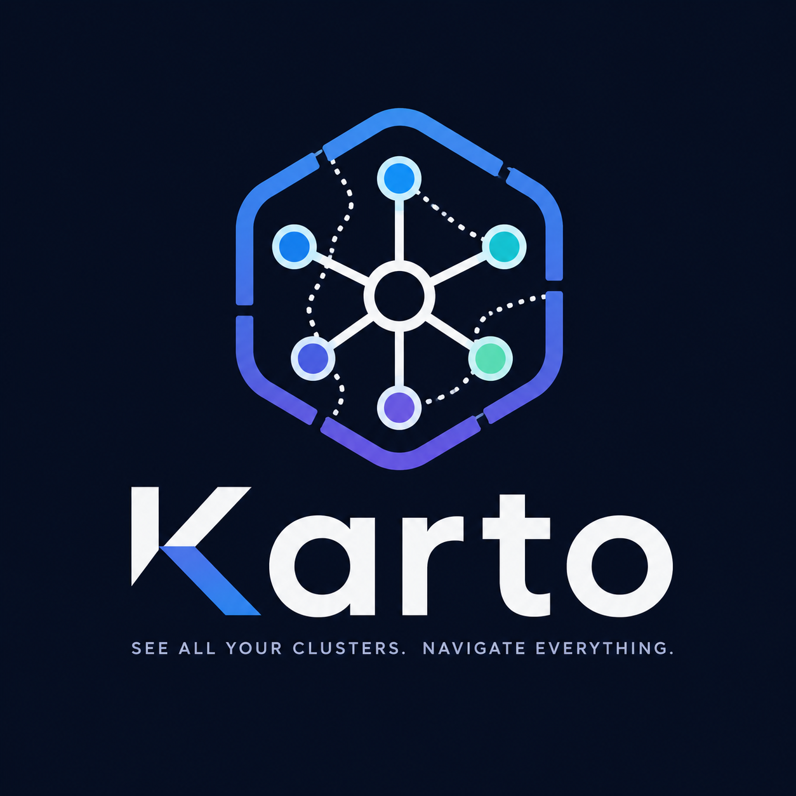

# Karto

<p align="center">
	
</p>

A small macOS Kubernetes browser for exploring clusters and namespace resources.

Karto is a desktop Kubernetes explorer built with Tauri, React, TypeScript, and Rust. It is designed for fast inspection workflows on macOS: choose an existing cluster context, browse namespaces, inspect workloads, follow logs, review events, and open raw YAML without leaving the desktop app.

The app does not create or manage kubeconfig contexts. It uses the contexts already available on your machine and shows only what your Kubernetes RBAC permissions allow it to read.

## Features

- Switch between the cluster contexts already present in your kubeconfig.
- Browse all namespaces or focus on a single namespace.
- Toggle between an application-focused view and a broader resource view.
- Search and filter resources by name, kind, or status.
- Inspect workload details including readiness, age, images, labels, annotations, pods, services, and resource requests or limits.
- Stream live workload logs directly in the app.
- Review Kubernetes events for the selected workload.
- Open the rendered YAML for supported resources.
- Explore Custom Resource Definitions grouped by API group and list custom resources dynamically.

## What Karto Is For

Karto is aimed at day-to-day cluster inspection rather than cluster administration. It is useful when you want to:

- verify what is running in a namespace,
- inspect workload health and related services,
- watch live logs during debugging,
- review recent Kubernetes events,
- inspect custom resources exposed by operators,
- read resource YAML without switching tools.

## What Karto Does Not Do

- It does not create, edit, or delete Kubernetes resources.
- It does not manage kubeconfig files or contexts.
- It does not bypass Kubernetes RBAC; visibility depends on your existing access.

## Stack

- Tauri 2 for the desktop shell
- React 19 and TypeScript for the UI
- Rust with `kube` and `k8s-openapi` for Kubernetes access

## Development

```bash
npm install
npm run tauri:dev
```

To create a production build:

```bash
npm run tauri:build
```

## Requirements

- Your kubeconfig contexts must already exist and be accessible.
- Your Kubernetes RBAC permissions determine which namespaces and resources are visible.
- macOS is the primary target environment for this project.

## License

This project is licensed under the MIT License. See the LICENSE file for details.

